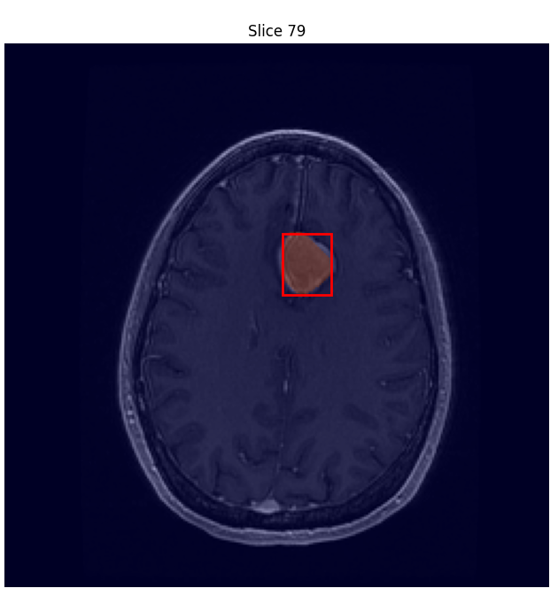

# Bounding Boxes Generation and Visualization

## Overview
This Python script is designed to extract bounding box coordinates from segmented medical images. These coordinates are essential for training deep learning models, as they allow for efficient localization and classification of regions of interest. By automating the extraction process, this script facilitates the preparation of training datasets for tasks such as tumor detection and medical image analysis.

This project contains Python code for generating 2D bounding boxes for each slice in a 3D medical image segmentation array. The bounding boxes are saved as a JSON file, and the code also includes functionality to visualize specific slices from the original volume with bounding boxes overlaid.


## Features

1. **Generate Bounding Boxes**: Extract 2D bounding boxes for non-zero regions in a 3D segmentation array.
2. **Save Results**: Save the bounding boxes as a JSON file.
3. **Visualization**: Display selected slices from the volume with bounding boxes and segmentation overlays.

## Requirements

To run the code, you need the following dependencies:

- Python 3.6+
- `numpy`
- `SimpleITK`
- `matplotlib`


Install the required libraries using pip:

```bash
pip install numpy SimpleITK matplotlib
```

## File Descriptions

- `main.py`: The main script containing the following functions:
  - `generate_bounding_boxes`: Generates 2D bounding boxes for each slice in a 3D segmentation array.
  - `display_slices_with_bounding_boxes_on_volume`: Displays selected slices from the volume with bounding boxes and segmentation overlays.
  - `main`: The entry point for the script to load data, generate bounding boxes, and visualize results.
- `bounding_boxes.json`: Output file storing the generated bounding boxes (created after running the script).

## How to Use

1. Place your 3D volume and segmentation files (in `.nrrd` format) in the same directory as the script.
2. Update the paths in the `main()` function to match the location of your volume and segmentation files:
   ```python
   volume_path = r"<path_to_your_volume_file>.nrrd"
   segmentation_path = r"<path_to_your_segmentation_file>.nrrd"
   ```
3. Run the script:
   ```bash
   python main.py
   ```
4. After running the script:
   - The bounding boxes will be saved to `bounding_boxes.json`.
   - A visualization window will display selected slices with bounding boxes overlaid.

## Outputs

- **Bounding Boxes JSON File**: Each entry contains:
  ```json
  {
      "slice_index": <int>,
      "bounding_box": [<min_x>, <min_y>, <max_x>, <max_y>] or `null` if no segmentation is found.
  }
  ```
- **Visualization**: Displays selected slices from the volume with bounding boxes and segmentation overlays.

## Example

Example output from `bounding_boxes.json`:

```json
[
    {
        "slice_index": 0,
        "bounding_box": null
    },
    {
        "slice_index": 1,
        "bounding_box": [45, 30, 120, 95]
    }
]
```

## Notes

- Ensure your `.nrrd` files are valid and accessible.
- Adjust the `num_slices_to_display` variable in the `main()` function to control the number of slices displayed.

## Segmentation Annotation

The initial segmentation annotation was performed using the 3D Slicer software, which allows for detailed and accurate segmentation of medical images.

## Visualization Example

Below is an example of a slice from the volume with a bounding box overlaid, generated by the script:



## License

This project is open-source and available under the MIT License.

